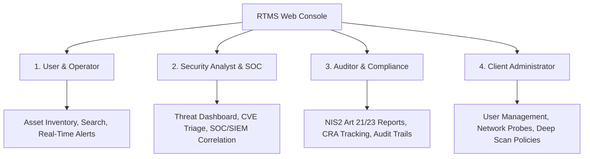

# RTMS Security Suite — User & Operations Guide

Welcome to the user documentation portal for the **RTMS** (*Real-Time Monitoring & Security*) platform, engineered by **3TS Consulting**.

RTMS is a unified platform delivering continuous network visibility, automated vulnerability correlation (CVE/NVD), early detection of network anomalies (ARP spoofing, open SMTP relays, unauthenticated databases), and regulatory compliance management (**NIS2** and **CRA**).

---

## 🧭 Choose Your Role Guide

The documentation is organized around the **four operational access profiles (RBAC)** of the platform:

-   :material-account-eye:{ .lg .middle } __1. Network Operator & User__

    ---

    Explore the user interface, navigate the real-time asset inventory, and monitor live network security alerts.

    [:octicons-arrow-right-24: Operator Guide](roles/user/navigation.md)

-   :material-shield-search:{ .lg .middle } __2. SOC & Security Analyst__

    ---

    Master the contextual Threat Dashboard, lead CVE vulnerability triage, and correlate findings with SIEM/SOC systems (Splunk, Wazuh, Suricata, CrowdStrike).

    [:octicons-arrow-right-24: SOC Analyst Guide](roles/analyst/threat_dashboard.md)

-   :material-clipboard-check-outline:{ .lg .middle } __3. Compliance Auditor (NIS2 / CRA)__

    ---

    Inspect NIS2 compliance dashboards, monitor Software Bills of Materials (CRA), and export verifiable audit reports in PDF and CSV.

    [:octicons-arrow-right-24: Auditor Guide](roles/auditor/nis2_compliance.md)

-   :material-cog-outline:{ .lg .middle } __4. Client Administrator__

    ---

    Manage users and RBAC permissions, configure scanning probes (Wi-Fi/Ethernet), and define subnet targeting and Deep Scan exclusion policies.

    [:octicons-arrow-right-24: Administrator Guide](roles/admin/users_and_rbac.md)

---

## ⚡ Platform Key Capabilities

* **Zero-Configuration Dynamic Inventory**: Passive and active asset discovery (ARP, ICMP, DHCP snooping, service banners, vendor OUI resolution).
* **Continuous Vulnerability Mapping**: Automated matching of detected software and services against local NIST/NVD catalogs.
* **Dual Opt-In Security Model**: Complete protection of fragile industrial networks (OT/PLC) through subnet-level authorization and asset exclusions.
* **Non-Intrusive Integrated Audits**: DNS integrity checks (SPF, DKIM, DMARC), open SMTP relay detection, SMBv1 verification, and unauthenticated database exposure.
* **Air-Gapped & Resilient Operation**: Uninterrupted monitoring during network outages with zero-data-loss local buffering.
