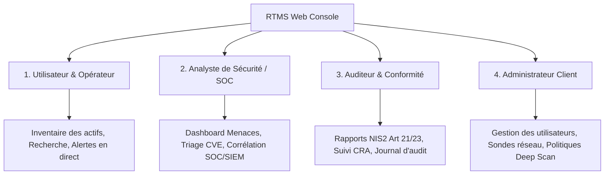

# RTMS Security Suite — Guide Utilisateur & Exploitation

Bienvenue sur le portail de documentation utilisateur de la suite **RTMS** (*Real-Time Monitoring & Security*), développée par **3TS Consulting**.

RTMS est une solution unifiée de surveillance continue du réseau, de cartographie des vulnérabilités (CVE/NVD), de détection précoce d'anomalies de sécurité (ARP spoofing, relais SMTP, bases non authentifiées) et de conformité réglementaire (**NIS2** et **CRA**).

---

## 🧭 Choisissez votre profil d'utilisation

La documentation est structurée selon les **quatre profils d'accès (RBAC)** de l'application :

-   :material-account-eye:{ .lg .middle } __1. Utilisateur & Opérateur Réseau__

    ---

    Découvrez l'interface utilisateur, naviguez dans l'inventaire en temps réel de vos équipements et surveillez le flux d'alertes réseau.

    [:octicons-arrow-right-24: Guide Utilisateur](roles/user/navigation.md)

-   :material-shield-search:{ .lg .middle } __2. Analyste de Sécurité & SOC__

    ---

    Maîtrisez le Dashboard de Menaces contextuel, pilotez le triage des vulnérabilités CVE, et corrélez les alertes avec vos outils SIEM/SOC (Splunk, Wazuh, Suricata, CrowdStrike).

    [:octicons-arrow-right-24: Guide Analyste SOC](roles/analyst/threat_dashboard.md)

-   :material-clipboard-check-outline:{ .lg .middle } __3. Auditeur & Conformité (NIS2 / CRA)__

    ---

    Accédez aux tableaux de bord de conformité NIS2, suivez la nomenclature logicielle (CRA) et exportez des rapports d'audit opposables en PDF et CSV.

    [:octicons-arrow-right-24: Guide Auditeur](roles/auditor/nis2_compliance.md)

-   :material-cog-outline:{ .lg .middle } __4. Administrateur Client__

    ---

    Gérez vos utilisateurs et rôles RBAC, déployez et configurez vos sondes réseau (Wi-Fi/Ethernet), et définissez les politiques de sous-réseaux et Deep Scan.

    [:octicons-arrow-right-24: Guide Administrateur](roles/admin/users_and_rbac.md)

---

## ⚡ Fonctionnalités Clés de la Plateforme

* **Inventaire Dynamique Zéro Configuration** : Détection passive et active des équipements connectés (ARP, ICMP, DHCP snooping, bannières, OUI constructeur).
* **Cartographie Continue des Vulnérabilités** : Rapprochement automatique des services et versions détectés avec le dictionnaire NIST/NVD local.
* **Double Consentement Strict (*Dual Opt-In*)** : Protection absolue des automates industriels (OT/PLC) et équipements sensibles grâce au ciblage granulaire du Deep Scan par sous-réseau et exclusion d'actifs.
* **Audits Intégrés Non Intrusifs** : Contrôle de l'intégrité DNS (SPF, DKIM, DMARC), détection de serveurs SMTP ouverts, détection SMBv1, et bases sans mot de passe.
* **Fonctionnement Déconnecté (Air-Gapped)** : Résilience intégrale en cas de coupure réseau grâce au tampon local zéro perte.
