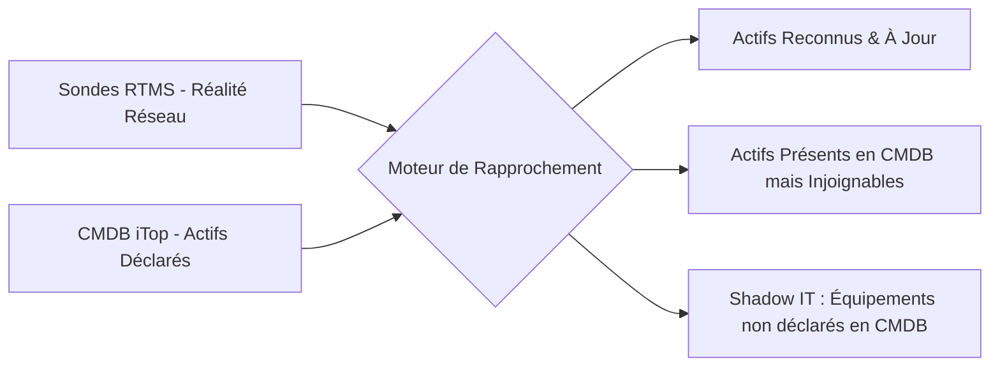

# Intégration & Réconciliation CMDB (iTop)

RTMS s'interface avec votre référentiel de gestion des configurations (**CMDB**, notamment **Combodo iTop**) pour réconcilier la réalité du terrain avec vos actifs déclarés.

---

## 1. Principe de Réconciliation

L'inventaire découvert sur le réseau en temps réel est automatiquement comparé à votre base CMDB :

* **Détection du Shadow IT** : Identification immédiate des équipements connectés au réseau d'entreprise qui ne figurent pas dans la CMDB officielle.
* **Actifs Fantômes** : Détection des équipements déclarés en CMDB mais qui n'émettent plus aucune trame réseau depuis une période prolongée.

---

## 2. Configuration de la Liaison iTop

Dans la configuration de l'administration RTMS :
* **URL du Web Service REST iTop** : `https://cmdb.company.local/webservices/rest.php`
* **Identifiants & Clés d'API** : Utilisation d'un compte de service dédié avec permissions de lecture sur les classes `Server`, `PC`, `NetworkDevice` et `VirtualMachine`.
* **Fréquence de Synchronisation** : Synchronisation planifiée automatique (par défaut toutes les heures) avec possibilité de déclenchement manuel instantané.
