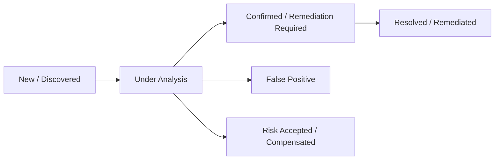

# Vulnerability Triage & Remediation (CVE)

The **Vulnerability Triage** module enables SOC analysts to investigate, prioritize, and arbitrate flaws identified through continuous NVD/CPE correlation.

---

## 1. Vulnerability Analysis Lifecycle

Each `(Asset, CVE)` pair maintains an analytical status managed by SOC analysts:

* **New**: Flaw identified during the latest scan cycle, pending analyst qualification.
* **Under Analysis**: Analyst is evaluating real-world exploitability within the enterprise network context.
* **Confirmed**: Verified vulnerability requiring package updates or security patching.
* **False Positive**: Service banner matched a generic criterion but the vulnerability does not apply (e.g. Debian/RHEL security backports).
* **Risk Accepted**: Compensating controls are active (e.g. device segregated within an air-gapped management VLAN).
* **Resolved**: Software has been upgraded and the CVE no longer appears in subsequent scans.

---

## 2. Contextual Risk Scoring

Rather than relying strictly on the theoretical **CVSS v3** score (0.0 to 10.0), RTMS weights risks according to operational posture:

$$\text{Contextual Score} = \text{CVSS v3} \times \text{Asset Criticality} \times \text{Network Exposure Factor}$$

* **Asset Criticality**: Core Production Server (1.5), Workstation (1.0), IoT / Peripheral (0.8).
* **Network Exposure Factor**: Internet-facing (2.0), Internal LAN (1.0), Air-gapped / Segregated DMZ (0.5).

This prioritization directs security operations toward the 5% of vulnerabilities presenting immediate intrusion vectors.
