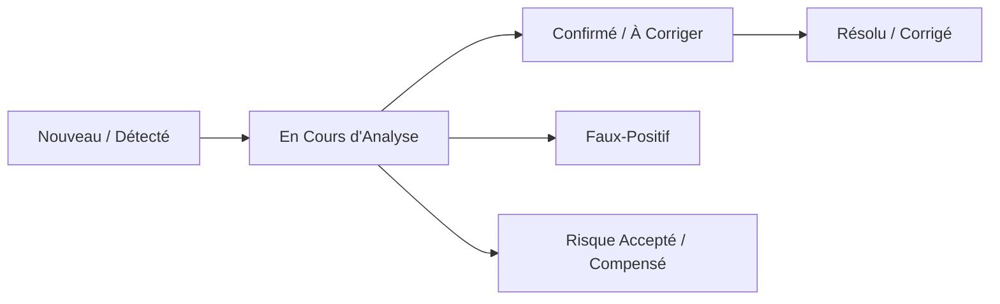

# Triage & Gestion des Vulnérabilités (CVE)

Le module de **Triage des Vulnérabilités** permet aux analystes de sécurité d'arbitrer les failles détectées par le rapprochement continu NVD/CPE.

---

## 1. Cycle de Vie d'une Vulnérabilité

Chaque couple `(Actif, CVE)` dispose d'un statut d'analyse modifiable par l'analyste SOC :

* **Nouveau (New)** : Vulnérabilité identifiée lors du dernier scan, en attente de qualification.
* **En Cours (In Progress)** : L'analyste vérifie l'exploitabilité réelle de la faille dans le contexte du réseau.
* **Confirmé (Confirmed)** : Faille avérée nécessitant une mise à jour logicielle ou un correctif de sécurité.
* **Faux-Positif (False Positive)** : La version ou le port correspond à une signature générique mais la vulnérabilité n'est pas applicable (ex: backport Debian/RHEL).
* **Risque Accepté (Accepted Risk)** : Mesure compensatoire en place (ex: équipement isolé dans un VLAN d'administration étanche).
* **Résolu (Resolved)** : Le logiciel a été mis à jour et la faille ne réapparaît plus lors des scans suivants.

---

## 2. Calcul du Score de Risque Contextuel

Plutôt que de s'en tenir uniquement au score brut **CVSS** (0.0 à 10.0), RTMS pondère le risque selon l'environnement réel :

$$\text{Score Contextuel} = \text{CVSS v3} \times \text{Criticité de l'Actif} \times \text{Facteur d'Exposition Réseau}$$

* **Criticité de l'Actif** : Serveur de production critique (1.5), Poste bureautique standard (1.0), Imprimante/IoT (0.8).
* **Exposition Réseau** : Accessible depuis Internet (2.0), Réseau interne d'entreprise (1.0), Réseau isolé ou DMZ stricte (0.5).

Cette priorisation permet aux équipes de sécurité de traiter en priorité les 5% de vulnérabilités qui présentent une menace directe d'intrusion.
