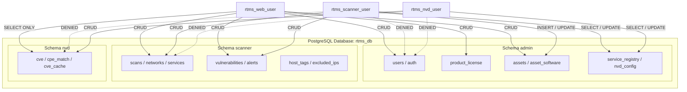

# Database Security & PostgreSQL RBAC Model

This document outlines the security architecture, schema segregation, and **PostgreSQL RBAC** model of the RTMS platform.

---

## 1. Isolation Principles & Least Privilege

The PostgreSQL database architecture is founded on two levels of containment:
1. **Logical Schema Segregation** (`admin`, `scanner`, `nvd`).
2. **Privilege Segregation by Application Roles** (*Principle of Least Privilege*).

No application microservice runs under the master database owner account (`rtms_user`) in production.

---

## 2. PostgreSQL Role Definitions

### A. `rtms_user` (Database Owner & Migrations)
* **Scope**: Owner (`OWNER`) of the database `rtms_db` and the 3 schemas.
* **Privileges**: Full DDL (`CREATE TABLE`, `ALTER TABLE`, `DROP`, `CREATE EXTENSION`).
* **Usage**: Used exclusively during deployment ([install.sh](file:///Users/marctritschler/git_projects/rtms-installer/install.sh)) and maintenance/backup workflows (`manage_schemas.py`, `pg_dump`).

### B. `rtms_nvd_user` (NVD Microservice)
* **Schema `nvd`**: Full Read/Write access (`SELECT`, `INSERT`, `UPDATE`, `DELETE`) across all tables (`cve`, `cpe_match`, `cve_cache`).
* **Schema `admin`**: Scoped table access:
  * `admin.nvd_config`: `SELECT`, `INSERT`, `UPDATE` (reading API keys and sync settings).
  * `admin.service_registry`: `SELECT`, `INSERT`, `UPDATE` (heartbeat and service presence).
  * `admin.cve_alerts` / `admin.cve_alerts_config`: `SELECT`, `INSERT` (triggering alerts if configured).
* **Schema `scanner`**: **Full Revocation (`REVOKE ALL`)**. No access to network scan data.
* **Security on `admin.users`**: **Full Revocation**. No access to administrator accounts or password hashes.

### C. `rtms_scanner_user` (Scanning Engine)
* **Schema `scanner`**: Full Read/Write access across all discovery and scan tables.
* **Schema `admin`**: Scoped table access:
  * `admin.assets` and `admin.asset_software`: `SELECT`, `INSERT`, `UPDATE` (persisting discovered hosts and software).
  * `admin.service_registry`: `SELECT`, `INSERT`, `UPDATE` (scanner heartbeat and operational state).
  * `admin.system_config`, `admin.subnet_names`, `admin.subnet_mac_whitelist`: `SELECT` (scanning policies and exclusion rules).
* **Schema `nvd`**: **Full Revocation (`REVOKE ALL`)**. The scanner does not touch the raw CVE database directly (vulnerability correlation is performed by the Web API).
* **Security on `admin.users`**: **Full Revocation**.

### D. `rtms_web_user` (FastAPI Backend & Dashboard)
* **Schema `admin`**: Full Read/Write access (user accounts, sessions, licenses, system configuration).
* **Schema `scanner`**: Full Read/Write access (scan orchestration, vulnerability acknowledgement).
* **Schema `nvd`**: **Strict Read-Only (`SELECT`)**.
  * Joins `scanner.vulnerabilities` with `nvd.cve` to display CVSS scores, descriptions, and metadata.
  * Formally prohibits mutations (`INSERT`, `UPDATE`, `DELETE`, `TRUNCATE`) to guarantee CVE data integrity.

---

## 3. Privileges Matrix Summary

| Resource / Table | `rtms_nvd_user` | `rtms_scanner_user` | `rtms_web_user` | `rtms_user` (Admin) |
| :--- | :---: | :---: | :---: | :---: |
| **`nvd.cve`** | ✅ CRUD | ❌ Denied | 👁️ **SELECT (Read-Only)** | 👑 Owner |
| **`nvd.cpe_match`** | ✅ CRUD | ❌ Denied | 👁️ **SELECT (Read-Only)** | 👑 Owner |
| **`nvd.cve_cache`** | ✅ CRUD | ❌ Denied | 👁️ **SELECT (Read-Only)** | 👑 Owner |
| **`scanner.*` (All tables)** | ❌ Denied | ✅ CRUD | ✅ CRUD | 👑 Owner |
| **`admin.assets`** | ❌ Denied | ✅ SELECT / INSERT / UPDATE | ✅ CRUD | 👑 Owner |
| **`admin.asset_software`** | ❌ Denied | ✅ SELECT / INSERT / UPDATE | ✅ CRUD | 👑 Owner |
| **`admin.service_registry`** | ✅ SELECT / INSERT / UPDATE | ✅ SELECT / INSERT / UPDATE | ✅ CRUD | 👑 Owner |
| **`admin.nvd_config`** | ✅ SELECT / INSERT / UPDATE | ❌ Denied | ✅ CRUD | 👑 Owner |
| **`admin.users`** | ❌ Denied | ❌ Denied | ✅ CRUD | 👑 Owner |
| **`admin.product_license`** | ❌ Denied | ❌ Denied | ✅ CRUD | 👑 Owner |
| **`admin.login_audit`** | ❌ Denied | ❌ Denied | ✅ CRUD | 👑 Owner |

---

## 4. Regulatory Compliance (NIS 2 / ISO 27001)

This database security model directly addresses:
* **NIS 2 - Article 21 (Cybersecurity risk-management measures)**: Software supply chain security and strict access controls.
* **ISO/IEC 27001 (Control A.9.2 - User access management)**: Access allocation founded on Need-to-Know and Least Privilege.
* **Lateral Movement Prevention**: In the event that a probe or the NVD ingestion worker is compromised, attackers cannot retrieve user credentials or tamper with vulnerability definitions.
