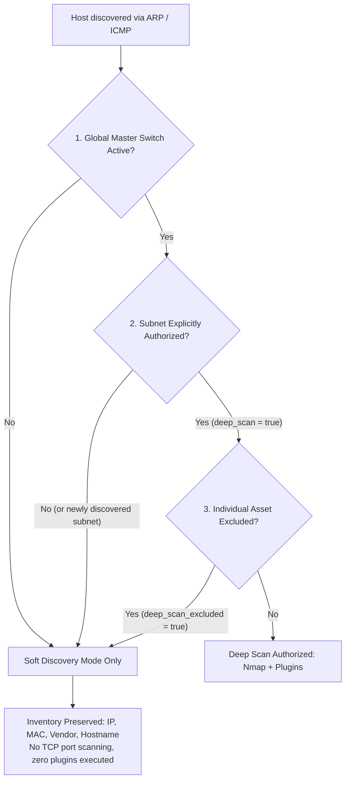

# Granular Deep Scan Targeting (Subnets & Asset Exclusions)

The **RTMS** platform enforces a **Dual Opt-In** security model for intrusive network probes (**Deep Scan** / `CMD_DISCOVER_SCAN`).

This architectural design addresses a critical operational security challenge inherent to **probe mobility (Roaming)**: when a mobile scanner (laptop, portable appliance, roving VM) transitions from an IT corporate subnet to a sensitive industrial or healthcare network (OT, SCADA, PLCs, medical infusion pumps, IoT), it must **never** execute intrusive scans inadvertently.

---

## 1. Dual Opt-In Security Model

For an asset to undergo deep inspection (Nmap port sweeps, service fingerprinting, and security vulnerability plugins), **TWO cumulative criteria** must be strictly satisfied, followed by individual asset exclusion verification:



### Rule 1: Global Master Switch
* If the global Deep Scan switch (`scanner.deep_scan`) is disabled (`false`), **no deep scan is ever executed**, regardless of individual subnet flags.
* The probe runs exclusively in passive/lightweight inventory discovery mode (`CMD_DISCOVER`).

### Rule 2: Subnet-Centric Opt-In
* Even when the global switch is enabled, **only explicitly authorized subnets** (`deep_scan = true` in database or specified in `scanner.deep_scan_subnets`) are targeted for Deep Scan.
* **Zero-Trust Default:** Any newly discovered or unconfigured subnet defaults to **`deep_scan = false`**.
* When a scanner roams to a sensitive PLC subnet (e.g., `192.168.100.0/24`), it automatically operates in soft discovery mode, preventing operational disruption.

### Rule 3: Asset-Level Exclusion
* Within a subnet authorized for deep scanning, delicate individual hosts (e.g., PLCs, medical sensors, brittle legacy printers) can be flagged with **`deep_scan_excluded = true`**.
* The asset remains fully present in the CMDB inventory, but intrusive TCP port scanning and plugin execution are completely bypassed.

---

## 2. Subnet-Level Configuration

### Scanner Configuration Keys

| Key | Type | Example | Description |
| :--- | :--- | :--- | :--- |
| `scanner.deep_scan` | Boolean | `true` | Global master switch authorizing deep scanning capabilities. |
| `scanner.deep_scan_subnets` | CSV List | `10.10.0.0/24, 172.16.0.0/16` | **Mandatory**: List of explicitly authorized subnets. *(Wildcard `*` allows all subnets).* |
| `scanner.deep_scan_exclude_subnets` | CSV List | `192.168.100.0/24` | Precedence exclusion list (blacklist). |

### PostgreSQL Database & Web API (`rtms-web`)

Database columns:
* `admin.subnet_names.deep_scan`: `BOOLEAN DEFAULT FALSE`
* `scanner.networks.deep_scan`: `BOOLEAN DEFAULT FALSE`

#### Enabling Deep Scan on a Subnet via REST API:
```http
POST /api/subnets/name
Content-Type: application/json
Authorization: Bearer <token>

{
  "subnet": "10.10.0.0/24",
  "name": "Production Server Network",
  "deep_scan": true
}
```

---

## 3. Asset-Level Exclusion Configuration

### PostgreSQL Database & Web API (`rtms-web`)

* `admin.assets.deep_scan_excluded`: `BOOLEAN NOT NULL DEFAULT FALSE`
* `admin.tenant_assets.deep_scan_excluded`: `BOOLEAN NOT NULL DEFAULT FALSE`

#### Excluding a Sensitive Device via REST API:
```http
POST /api/assets/update
Content-Type: application/json
Authorization: Bearer <token>

{
  "ip": "10.10.0.50",
  "deep_scan_excluded": true
}
```

The probe retrieves these exclusions dynamically via `GET /api/scanner/config`:
* `deep_scan_exclude_ips`: `["10.10.0.50"]`
* Inside `known_hosts`: `{"ip": "10.10.0.50", "deep_scan_excluded": true}`

---

## 4. Test Suite Validation

The test suite [`tests/test_deep_scan_targeting.py`](file:///Users/marctritschler/git_projects/rtms-scanner/tests/test_deep_scan_targeting.py) validates:
1. **Global Master Switch**: Deep scan is rejected when `scanner.deep_scan = false`, even if a subnet is permitted.
2. **Subnet Requirement**: Deep scan is rejected (`False`) when `scanner.deep_scan = true` but no subnet list is provided.
3. **Strict Targeting**: Deep scan is granted only to matching subnets (including CIDR child subnets) and denied to unauthorized subnets.
4. **Asset Exclusions**: Delicate hosts preserve basic inventory while completely bypassing Nmap and vulnerability plugins.
