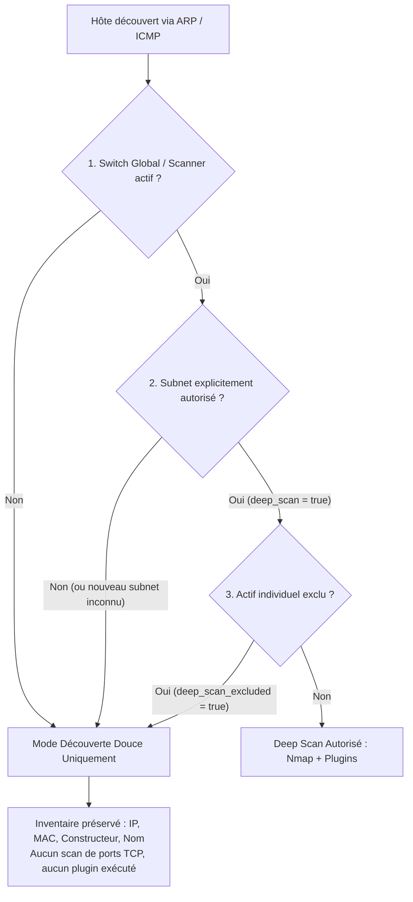

# Ciblage Granulaire du Deep Scan (Sous-réseaux & Exclusions d'Actifs)

La suite **RTMS** implémente une politique de **double consentement strict (Dual Opt-In)** pour l'exécution des scans approfondis (**Deep Scan** / `CMD_DISCOVER_SCAN`).

Cette approche résout un problème critique de sécurité opérationnelle lié à la **mobilité des sondes (Roaming)** : lorsqu'un scanner physique (ordinateur portable, appliance nomade, VM) est déplacé d'un réseau informatique (IT) vers un réseau industriel ou sensible (OT, automates PLC, équipements médicaux, IoT), il ne doit **jamais** exécuter de scan agressif par inadvertance.

---

## 1. Règle du Double Consentement Strict (Dual Opt-In)

Pour qu'un hôte fasse l'objet d'un scan approfondi (Nmap, énumération de ports, plugins de vulnérabilités), **DEUX conditions cumulatives** doivent être obligatoirement satisfaites, complétées par la vérification d'exclusion individuelle :



### Règle 1 : Le Coupe-Circuit Global (*Global Master Switch*)
* Si le switch global Deep Scan (`scanner.deep_scan`) est désactivé (`false`), **aucun Deep Scan n'est jamais exécuté**, quel que soit le sous-réseau ou sa configuration.
* Le scanner opère alors en sonde passive / légère d'inventaire (`CMD_DISCOVER`).

### Règle 2 : L'Autorisation Explicite par Sous-Réseau (*Subnet-Centric Opt-In*)
* Même si le Deep Scan global est actif, **seuls les sous-réseaux explicitement autorisés** (`deep_scan = true` en base ou présents dans `scanner.deep_scan_subnets`) feront l'objet d'un Deep Scan.
* **Sécurité par défaut (Zero Trust)** : tout sous-réseau nouvellement découvert ou non explicitement activé a la valeur **`deep_scan = false`**.
* Lors du déplacement d'un scanner vers un réseau sensible d'automates (ex : `192.168.100.0/24`), le scanner bascule automatiquement en mode découverte douce, éliminant tout risque de perturbation matérielle.

### Règle 3 : L'Exclusion Granulaire par Actif (*Asset-Level Exclude*)
* Au sein d'un sous-réseau où le Deep Scan est actif, un actif individuel (ex: automate de supervision, automate de perfusion, imprimante réseau) peut être marqué comme **`deep_scan_excluded = true`**.
* Il reste présent dans l'inventaire CMDB mais ses ports ne sont jamais audités.

---

## 2. Configuration au Niveau Sous-Réseau

### Clés de Configuration Scanner

| Clé | Type | Exemple | Description |
| :--- | :--- | :--- | :--- |
| `scanner.deep_scan` | Booléen | `true` | Coupe-circuit global pour autoriser le scanner à pratiquer le Deep Scan. |
| `scanner.deep_scan_subnets` | Liste CSV | `10.10.0.0/24, 172.16.0.0/16` | **Obligatoire** : liste des sous-réseaux explicitement autorisés. *(Possibilité d'utiliser `*` pour autoriser tous les sous-réseaux).* |
| `scanner.deep_scan_exclude_subnets` | Liste CSV | `192.168.100.0/24` | Liste d'exclusion prioritaire (blacklist). |

### Base de Données PostgreSQL & API (`rtms-web`)

Dans la base de données :
* `admin.subnet_names.deep_scan` : `BOOLEAN DEFAULT FALSE`
* `scanner.networks.deep_scan` : `BOOLEAN DEFAULT FALSE`

#### Activer le Deep Scan sur un Sous-Réseau via l'API :
```http
POST /api/subnets/name
Content-Type: application/json
Authorization: Bearer <token>

{
  "subnet": "10.10.0.0/24",
  "name": "Réseau Serveurs Production",
  "deep_scan": true
}
```

---

## 3. Configuration de l'Exclusion par Actif

### Base de Données PostgreSQL & API (`rtms-web`)

* `admin.assets.deep_scan_excluded` : `BOOLEAN NOT NULL DEFAULT FALSE`
* `admin.tenant_assets.deep_scan_excluded` : `BOOLEAN NOT NULL DEFAULT FALSE`

#### Exclure un équipement sensible du Deep Scan via l'API :
```http
POST /api/assets/update
Content-Type: application/json
Authorization: Bearer <token>

{
  "ip": "10.10.0.50",
  "deep_scan_excluded": true
}
```

Le scanner reçoit cette information dynamiquement via `GET /api/scanner/config` :
* `deep_scan_exclude_ips`: `["10.10.0.50"]`
* Dans `known_hosts` : `{"ip": "10.10.0.50", "deep_scan_excluded": true}`

---

## 4. Validation des Tests Unitaires

La suite de tests unitaires [`tests/test_deep_scan_targeting.py`](file:///Users/marctritschler/git_projects/rtms-scanner/tests/test_deep_scan_targeting.py) valide rigoureusement :
1. **Coupe-circuit global** : si `scanner.deep_scan = false`, le test vérifie que le Deep Scan est refusé même pour un subnet autorisé.
2. **Exigence du sous-réseau** : si `scanner.deep_scan = true` mais qu'aucun sous-réseau n'est spécifié, le Deep Scan est refusé (`False`).
3. **Ciblage strict** : vérifie que le Deep Scan est accordé au sous-réseau autorisé (et à ses sous-réseaux enfants CIDR) mais refusé aux autres.
4. **Exclusion d'actifs** : vérifie que les hôtes protégés conservent leur inventaire et court-circuitent Nmap et les plugins.
