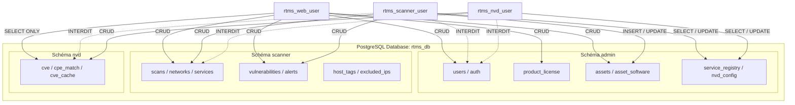

# Sécurité & Modèle RBAC de la Base de Données

Ce document décrit l'architecture de sécurité, la séparation des schémas et le modèle **RBAC PostgreSQL** de la plateforme RTMS.

---

## 1. Principes d'Isolation & Moindre Privilège

L'architecture de la base de données PostgreSQL repose sur deux niveaux de protection :
1. **Cloisonnement logique par schémas** (`admin`, `scanner`, `nvd`).
2. **Cloisonnement des privilèges par rôles applicatifs** (*Principle of Least Privilege*).

Aucun microservice applicatif n'utilise le compte propriétaire maître (`rtms_user`) en production.

---

## 2. Définition des Rôles PostgreSQL

### A. `rtms_user` (Propriétaire de la Base & Migrations)
* **Périmètre** : Propriétaire (`OWNER`) de la base `rtms_db` et des 3 schémas.
* **Privilèges** : DDL complet (`CREATE TABLE`, `ALTER TABLE`, `DROP`, `CREATE EXTENSION`).
* **Usage** : Utilisé exclusivement lors de l'installation ([install.sh](file:///Users/marctritschler/git_projects/rtms-installer/install.sh)) et pour les opérations de maintenance/sauvegarde (`manage_schemas.py`, `pg_dump`).

### B. `rtms_nvd_user` (Microservice NVD)
* **Schéma `nvd`** : Accès complet Lecture/Écriture (`SELECT`, `INSERT`, `UPDATE`, `DELETE`) sur toutes les tables (`cve`, `cpe_match`, `cve_cache`).
* **Schéma `admin`** : Accès restreint par table :
  * `admin.nvd_config` : `SELECT`, `INSERT`, `UPDATE` (lecture des clés API et paramètres de synchronisation).
  * `admin.service_registry` : `SELECT`, `INSERT`, `UPDATE` (enregistrement de la présence et heartbeat).
  * `admin.cve_alerts` / `admin.cve_alerts_config` : `SELECT`, `INSERT` (déclenchement d'alertes directes si configuré).
* **Schéma `scanner`** : **Révocation totale (`REVOKE ALL`)**. Aucun accès aux données de scan réseau.
* **Sécurité `admin.users`** : **Révocation totale**. Impossible d'accéder aux comptes administrateurs.

### C. `rtms_scanner_user` (Moteur de Scan)
* **Schéma `scanner`** : Accès complet Lecture/Écriture sur toutes les tables de découverte et de scan.
* **Schéma `admin`** : Accès ciblé :
  * `admin.assets` et `admin.asset_software` : `SELECT`, `INSERT`, `UPDATE` (persistance des actifs et inventaires découverts).
  * `admin.service_registry` : `SELECT`, `INSERT`, `UPDATE` (heartbeat et état du scanner).
  * `admin.system_config`, `admin.subnet_names`, `admin.subnet_mac_whitelist` : `SELECT` (règles et politiques d'exclusion).
* **Schéma `nvd`** : **Révocation totale (`REVOKE ALL`)**. Le scanner n'a pas accès à la base de vulnérabilités NVD brute (le matching s'effectue via l'API Web).
* **Sécurité `admin.users`** : **Révocation totale**.

### D. `rtms_web_user` (Backend FastAPI & Dashboard)
* **Schéma `admin`** : Accès complet Lecture/Écriture (gestion des utilisateurs, sessions, licences, configuration).
* **Schéma `scanner`** : Accès complet Lecture/Écriture (gestion et lancement des scans, acquittement des vulnérabilités).
* **Schéma `nvd`** : **Lecture Seule Stricte (`SELECT`)**.
  * Permet de joindre `scanner.vulnerabilities` avec `nvd.cve` pour afficher les scores CVSS, descriptions et métadonnées.
  * Interdit formellement toute modification (`INSERT`, `UPDATE`, `DELETE`, `TRUNCATE`) pour garantir l'intégrité de la base CVE.

---

## 3. Matrice Récapitulative des Privilèges

| Ressource / Table | `rtms_nvd_user` | `rtms_scanner_user` | `rtms_web_user` | `rtms_user` (Admin) |
| :--- | :---: | :---: | :---: | :---: |
| **`nvd.cve`** | ✅ CRUD | ❌ Accès Refusé | 👁️ **SELECT (Lecture Seule)** | 👑 Owner |
| **`nvd.cpe_match`** | ✅ CRUD | ❌ Accès Refusé | 👁️ **SELECT (Lecture Seule)** | 👑 Owner |
| **`nvd.cve_cache`** | ✅ CRUD | ❌ Accès Refusé | 👁️ **SELECT (Lecture Seule)** | 👑 Owner |
| **`scanner.*` (Toutes tables)** | ❌ Accès Refusé | ✅ CRUD | ✅ CRUD | 👑 Owner |
| **`admin.assets`** | ❌ Accès Refusé | ✅ SELECT / INSERT / UPDATE | ✅ CRUD | 👑 Owner |
| **`admin.asset_software`** | ❌ Accès Refusé | ✅ SELECT / INSERT / UPDATE | ✅ CRUD | 👑 Owner |
| **`admin.service_registry`** | ✅ SELECT / INSERT / UPDATE | ✅ SELECT / INSERT / UPDATE | ✅ CRUD | 👑 Owner |
| **`admin.nvd_config`** | ✅ SELECT / INSERT / UPDATE | ❌ Accès Refusé | ✅ CRUD | 👑 Owner |
| **`admin.users`** | ❌ Accès Refusé | ❌ Accès Refusé | ✅ CRUD | 👑 Owner |
| **`admin.product_license`** | ❌ Accès Refusé | ❌ Accès Refusé | ✅ CRUD | 👑 Owner |
| **`admin.login_audit`** | ❌ Accès Refusé | ❌ Accès Refusé | ✅ CRUD | 👑 Owner |

---

## 4. Conformité Réglementaire (NIS 2 / ISO 27001)

Ce modèle répond directement aux exigences suivantes :
* **NIS 2 - Article 21 (Mesures de gestion des risques de cybersécurité)** : Sécurisation de la chaîne d'approvisionnement logicielle et contrôle strict des accès.
* **ISO/IEC 27001 (Mesure A.9.2 - Gestion des accès utilisateurs)** : Attribution des accès basée sur le besoin d'en connaître (*Need to Know*) et le moindre privilège (*Least Privilege*).
* **Protection contre le déplacement latéral** : En cas de compromission d'une sonde locale ou du microservice NVD, un attaquant ne peut ni accéder aux identifiants des utilisateurs, ni altérer les signatures de vulnérabilités.
