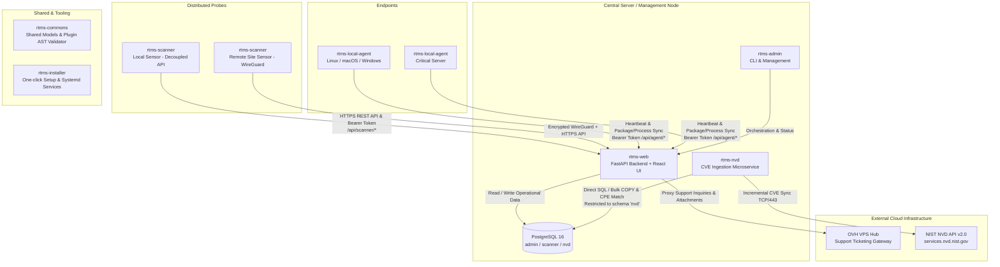

# RTMS — Global System Architecture

## Overview

RTMS (Real-Time Monitoring & Security) is a modular, distributed cybersecurity audit and compliance platform designed for enterprise and critical infrastructure visibility.

---

## Repositories & Components

| Repository | Role | Technology Stack |
| :--- | :--- | :--- |
| **`rtms-web`** | Central web dashboard, REST API, authentication (SSO Keycloak, Local Break-Glass, 2FA), scanner token lifecycle manager, asset and vulnerability visualization, and support ticketing hub. | FastAPI, Python 3.13+, React 19, TypeScript, Vite |
| **`rtms-scanner`** | Continuous discovery probes executing ARP/ICMP sweeps, port scans, OS fingerprinting, and security plugins. Communicates via Decoupled REST API (`/api/scanner/*`). | Python 3.12+, Scapy, Nmap, SQLite / DuckDB |
| **`rtms-commons`** | Shared data structures, database connectors, constants, and the AST static code analyzer for plugin security verification. | Python package |
| **`rtms-local-agent`** | Lightweight agent running on audited hosts for deep introspection (installed packages, system metrics, processes). | Python / Cross-platform |
| **`rtms-nvd`** | Offline / local CVE synchronization service ingesting the National Vulnerability Database directly into schema `nvd`. | Python, PostgreSQL (least-privilege `rtms_nvd_user`) |
| **`rtms-installer`** | Automated deployment scripts, systemd service descriptors, and initialization helpers. | Bash, systemd |
| **`rtms-admin`** | CLI administration utilities and WireGuard site-to-site configuration helpers. | Python CLI, WireGuard |
| **`rtms-documentation`** | Unified documentation portal (architecture, technical specs, compliance, and developer guides). | Markdown / MkDocs Material |

---

## Inter-Component Communication & Security Boundaries

### 1. Decoupled Scanner to Web API (`rtms-scanner` -> `rtms-web`)
* **Transport**: Strictly HTTPS (TCP/443 or custom port). Distributed network probes **do not require direct PostgreSQL port 5432 access**.
* **Authentication**: Dedicated **Bearer Tokens** generated from the RTMS Web Console (**Services Status** modal).
* **Token Hardening**:
  * Raw tokens are stored exclusively as SHA-256 hashes in `admin.scanner_tokens`.
  * Token validity is strictly capped at **365 days (1 year)**.
  * Instant administrator revocation and non-disruptive renewal workflow (`/api/scanner/renew-token`).
* **Endpoints**:
  * `/api/scanner/heartbeat`: Scanner health, local interfaces, IP addresses, and media policy status.
  * `/api/scanner/sync-results`: Discovered hosts, open ports, OS detection, and security anomalies.
  * `/api/scanner/config`: Dynamic hot-reloaded scanning policies and timing.

### 2. NVD Service to PostgreSQL Database (`rtms-nvd` -> PostgreSQL)
* **Direct Access Rationale**: `rtms-nvd` retains a direct PostgreSQL connection due to mass vulnerability ingestion (> 250,000 CVEs), high-performance compressed SQL streaming via `COPY`, and complex relational CPE matching against the local inventory.
* **Least Privilege Isolation (`harden_nvd_user.sql`)**:
  * The service connects using a dedicated role `rtms_nvd_user`.
  * Granted permissions **strictly on schema `nvd`** (`nvd.cve`, `nvd.cpe_match`, `nvd.cve_cache`).
  * Permissions to sensitive schemas (`admin` containing user accounts and passwords, `scanner`, and `public`) are explicitly revoked.

### 3. Local Agent to Web API (`rtms-local-agent` -> `rtms-web`)
* The agent sends periodic heartbeats and inventories (packages, running processes, resource metrics) via authenticated HTTP POST endpoints.

### 4. Central Support Hub Integration (`rtms-web` -> OVH VPS)
* Centralized customer assistance gateway hosted on a dedicated OVH VPS (`vps-054fcfa2.vps.ovh.net`).
* RTMS Web acts as a secure authenticated reverse proxy (`/api/support/tickets`, `/api/support/tickets/history`), allowing operators to submit support tickets, logs, and diagnostic screenshots directly from the web console.

### 5. WireGuard VPN Tunneling (`rtms-admin`)
* For multi-site deployments, remote scanners establish encrypted WireGuard tunnels back to the central server network.
