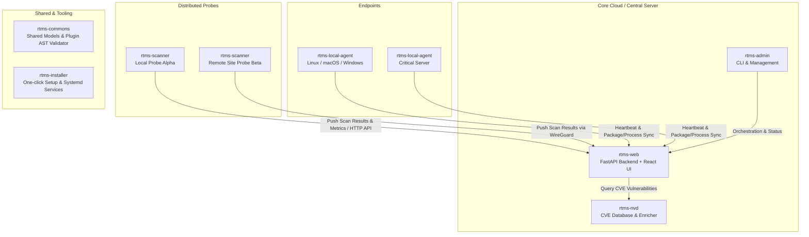

# RTMS — Global System Architecture

## Overview

RTMS (Real-Time Monitoring & Security) is a modular, distributed cybersecurity audit and compliance platform designed for enterprise and critical infrastructure visibility.

---

## Repositories & Components

| Repository | Role | Technology Stack |
| :--- | :--- | :--- |
| **`rtms-web`** | Central web dashboard, REST API, authentication (SSO Keycloak, Local Break-Glass, 2FA), asset and vulnerability visualization. | FastAPI, Python 3.12+, React 19, TypeScript, Vite |
| **`rtms-scanner`** | Discovery probes executing continuous ARP/ICMP ping sweeps, port scans, OS finger-printing, and security plugins. | Python 3.12+, Scapy, Nmap, SQLite / DuckDB |
| **`rtms-commons`** | Shared data structures, constants, and the AST static code analyzer for plugin security verification. | Python package |
| **`rtms-local-agent`** | Lightweight agent running on audited hosts for deep introspection (installed packages, system metrics, processes). | Python / Cross-platform |
| **`rtms-nvd`** | Offline / local CVE synchronization service ingesting the National Vulnerability Database. | FastAPI, SQLite / PostgreSQL |
| **`rtms-installer`** | Automated deployment scripts, systemd service descriptors, and initialization helpers. | Bash, systemd |
| **`rtms-admin`** | CLI administration utilities and WireGuard site-to-site configuration helpers. | Python CLI, WireGuard |
| **`rtms-documentation`** | Unified documentation portal (architecture, technical specs, compliance, and developer guides). | Markdown / Docs-as-code |

---

## Inter-Component Communication

1. **Scanner to Web API (`rtms-scanner` -> `rtms-web`)**
   - Scanners push periodic scan results (discovered hosts, open ports, plugin findings) to `/api/scan-results` or via database sync.
   - Live health checks and active interfaces are reported to `/api/scanner/health`.
2. **Local Agent to Web API (`rtms-local-agent` -> `rtms-web`)**
   - The agent sends periodic heartbeats and inventories (packages, running processes, resource metrics) via authenticated HTTP POST endpoints.
3. **Web API to NVD (`rtms-web` -> `rtms-nvd`)**
   - RTMS Web queries RTMS NVD service to correlate discovered software versions with active CVEs.
4. **WireGuard VPN Tunneling (`rtms-admin`)**
   - For multi-site deployments, remote scanners establish encrypted WireGuard tunnels back to the central server.
