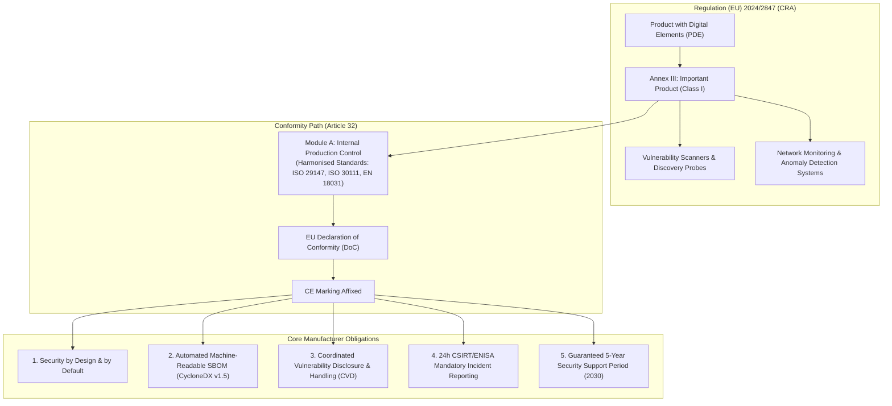
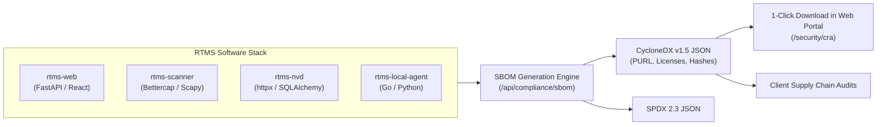
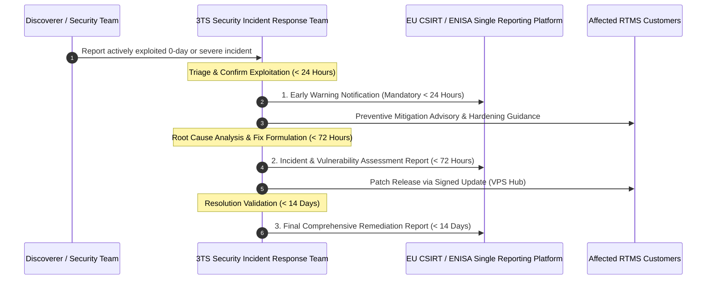

# RTMS - Cyber Resilience Act (CRA) Compliance & Architecture

## 1. Executive Summary & Regulatory Scope

The **Cyber Resilience Act (Regulation (EU) 2024/2847 - CRA)** establishes horizontal, mandatory cybersecurity requirements for all products with digital elements placed on the European Union market.

The **Risk & Threat Management System (RTMS)**, engineered and maintained by **3TS Consulting SRL**, is an on-premises and distributed cybersecurity management platform providing automated network discovery, host and service mapping, vulnerability assessment (NIST NVD/CVE), ARP anomaly detection, and IT compliance governance.

Because RTMS executes vulnerability scanning, perimeter interrogation, and security monitoring functions, it falls under the **Class I "Important Product with Digital Elements"** regime as defined in **Annex III of Regulation (EU) 2024/2847**.

---

## 2. Product Classification & Conformity Assessment Procedure

### Classification Justification (Annex III - Class I)
Under Annex III of the Cyber Resilience Act, products that perform security discovery, network inspection, and vulnerability triage are classified as **Important Products with Digital Elements (Class I)**:
1. **Network Discovery & Port Probing (`rtms-scanner`)**: Inspects ARP caches, TCP/UDP open ports, and SNMP gateways across enterprise subnets.
2. **Vulnerability Assessment Engine (`rtms-nvd`)**: Ingests the NIST National Vulnerability Database, matches Common Platform Enumerations (CPE), and identifies Common Vulnerabilities and Exposures (CVE).
3. **Local Endpoint Security Agent (`rtms-local-agent`)**: Collects local software inventory and OS-level configurations for compliance reporting.

### Conformity Assessment Procedure (Module A)
In accordance with **Article 32(1)** of the CRA, 3TS Consulting applies **Module A (Internal Control of Production)**:
- **Dossier Technique (Technical Documentation - Annex VII)**: Detailed architecture models, threat matrix, cryptographic proofs, and dependency records.
- **Harmonised Standards Alignment**: Full compliance with ISO/IEC 29147, ISO/IEC 30111, OWASP ASVS/Top 10, and EN 18031 drafts.
- **EU Declaration of Conformity**: Affirmed and maintained under the sole responsibility of 3TS Consulting SRL.
- **CE Marking**: Affixed digitally within the RTMS software portal (`/security/cra`, `/help/about`) and in production distribution artifacts.

---

## 3. Essential Cybersecurity Requirements (Annex I, Part I)

RTMS meets each core technical requirement stipulated in Annex I, Part I of the CRA:

| CRA Requirement | Objective | RTMS Technical Implementation |
| :--- | :--- | :--- |
| **Security by Default** (Req. 1.1) | No insecure default passwords or open administrative backdoors. | First-login Setup Wizard forces root password change. Non-MFA passwords enforce adaptive 90-day expiration with J-14 warnings. |
| **Attack Surface Minimization** (Req. 1.2) | Disable unnecessary ports, services, and cleartext protocols. | Zero unencrypted HTTP or plaintext telnet. All inter-service communications run over TLS 1.3 or local Unix Domain Sockets. |
| **Identity & Access Management** (Req. 1.3) | Strict authentication, credential protection, and least privilege. | Granular 4-role RBAC (`admin`, `security_analyst`, `operator`, `viewer`). Mandatory RFC 6238 TOTP MFA for administrators. Session timeouts (15m admin, 30m user). |
| **Data Protection & Cryptography** (Req. 1.4) | Confidentiality and integrity of stored and transit telemetry. | Passwords hashed with bcrypt (work factor 12). Appliance identity authenticated via Ed25519 signatures. Offline RSA-2048/SHA-256 license sealing. |
| **Integrity & Tamper Protection** (Req. 1.5) | Prevent unauthorized code alteration and spoofing. | Cryptographic package hash verification (SHA-256) on update ingestion. Triple-tier ARP spoofing and poisoning detection engine. |
| **Security Logging & Auditability** (Req. 1.6) | Maintain non-repudiable audit trails of sensitive actions. | Immutable audit tables (`admin.login_audit`, `admin.system_audit`, `scanner.alerts`). Access restricted to compliance auditors (`viewer`) and SOC analysts. |
| **Secure Update Mechanism** (Req. 1.7) | Signed updates with verification and rollback capability. | Central VPS Support Hub delivers cryptographically hashed `.tar.gz` releases with automatic staging and verification. |

---

## 4. Software Bill of Materials (SBOM) & Supply Chain Transparency

In compliance with **Annex I, Part II (Requirement 1)**, RTMS maintains an automated, machine-readable Software Bill of Materials in the **CycloneDX v1.5 (ECMA-424)** standard format.

### SBOM Architecture

### Standard PURL Identification & Metadata
Every direct and transitive library is attributed with:
- Standard Package URL (e.g. `pkg:pypi/fastapi@0.104.1`, `pkg:npm/react@18.2.0`).
- Exact component version and SHA-256 integrity digest.
- Declared open-source license identifier (SPDX ID: MIT, Apache-2.0, BSD-3-Clause).
- Scope indicator (`required` for production runtime, `excluded` for development tooling).

---

## 5. Vulnerability Handling & Mandatory Reporting (Annex I, Part II)

### A. Coordinated Vulnerability Disclosure (CVD - ISO/IEC 29147)
3TS Consulting maintains a public Coordinated Vulnerability Disclosure policy:
- **Security Inquiries Contact:** `security@3ts-consulting.com`
- **Encryption:** Public PGP Key available for secure submission of vulnerability reports.
- **Initial Response SLA:** 3TS security engineers acknowledge and initiate triage for all submitted vulnerabilities within **48 hours** (ISO/IEC 30111).
- **Public Policy:** Available at [SECURITY.md](file:///Users/marctritschler/git_projects/rtms-web/SECURITY.md) and exposed via `GET /api/compliance/cra`.

### B. CRA 24-Hour Mandatory Incident Notification Workflow
Under **Article 14 of Regulation (EU) 2024/2847**, software manufacturers must notify authorities of actively exploited vulnerabilities or severe security incidents:

1. **Step 1: Early Warning (< 24 Hours)**: Notification sent to the designated national CSIRT (CCB in Belgium, ANSSI in France) and ENISA via the European single reporting platform upon confirming active exploitation.
2. **Step 2: Incident Assessment (< 72 Hours)**: Technical report outlining vulnerability severity, affected versions, and interim risk-mitigation measures.
3. **Step 3: Final Remediation Report (< 14 Days)**: Comprehensive disclosure describing root-cause analysis, corrective patch details, and customer deployment statistics.

---

## 6. Guaranteed Security Support Period

In adherence to **Article 13(8)** of the Cyber Resilience Act, the manufacturer must determine and declare the support period during which security updates will be provided free of charge:

* **Declared Support Period:** Minimum **5 years** from the official general availability date.
* **Current Commitment:** Full vulnerability remediation, CVE updates, and security patches are legally guaranteed until **December 31, 2030** for the RTMS v1.x series.
* **Post-Support Transparency:** Any upcoming End-of-Support (EOS) milestone will be announced at least 12 months in advance via the RTMS Web Portal banner and official customer advisories.

---

## 7. REST API Endpoints for CRA Auditing

The RTMS backend provides native machine-readable endpoints for security compliance auditors:

| Method | Path | Description | Access Control |
| :--- | :--- | :--- | :--- |
| `GET` | `/api/compliance/cra` | Full CRA compliance dossier (classification, CE status, support period, CVD contact, standards) | Authenticated (JWT) |
| `GET` | `/api/compliance/sbom` | Exports the machine-readable CycloneDX v1.5 JSON or SPDX Software Bill of Materials | Authenticated (JWT) |
| `GET` | `/api/compliance/eu-declaration` | Retrieves or downloads the signed EU Declaration of Conformity | Authenticated (JWT) |
