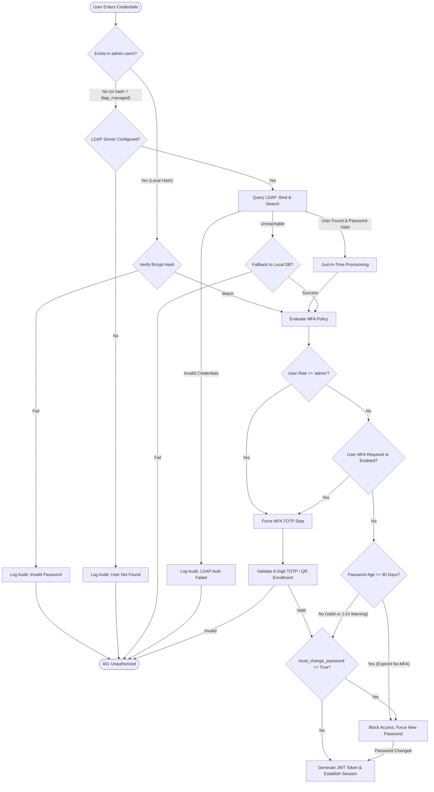

# RTMS - NIS 2 Directive Compliance & Authentication Architecture

## 1. Executive Summary

This document details the authentication and access control architecture of the **Risk & Threat Management System (RTMS)** and demonstrates full compliance with the European **NIS 2 Directive (Directive (EU) 2022/2555)** on cybersecurity risk-management measures.

RTMS employs a **hybrid, multi-layered identity architecture** supporting Local Break-Glass administration, Corporate LDAP/Active Directory integration, and Enterprise Single Sign-On (SSO / OIDC / SAML), backed by mandatory Multi-Factor Authentication (MFA) and immutable audit logging.

---

## 2. NIS 2 Directive Mapping Matrix

| NIS 2 Article | Requirement | RTMS Technical Implementation | Compliance Status |
| :--- | :--- | :--- | :--- |
| **Art. 21.2(j)** | **Multi-Factor Authentication (MFA)** for privileged / administrative access | Mandatory TOTP (6-digit RFC 6238) QR code enrollment for all `admin` accounts (Local & LDAP). Configurable for standard users. | **Compliant (100%)** |
| **Art. 21.2(c)** | **Business Continuity & Crisis Management** | Local "Break-Glass" emergency administration accounts ensuring platform availability during Active Directory / network outages. | **Compliant (100%)** |
| **Art. 21.2(a)** | **Risk Analysis & Credential Security** | Forced password renewal (`must_change_password`) on first login; real-time password complexity enforcement (min 8 chars, uppercase, lowercase, numbers); first-run setup wizard; **adaptive 90-day password expiration** for non-MFA accounts with **J-14 early warning**; full rotation exemption for MFA-secured accounts (NIST SP 800-63B / ISO 27001). | **Compliant (100%)** |
| **Art. 21.2(g)** | **Cyber Hygiene & Cryptography** | Bcrypt hashing with dynamic salt for local credentials; PyJWT signed tokens with differential session timeouts (15 min for admins, 30 min for users); TLS 1.2/1.3 reverse proxy encryption for all transport data and bearer tokens. | **Compliant (100%)** |
| **Art. 21.2(b)** | **Incident Handling, Audit & Logging** | Immutable audit trails in `admin.login_audit` and `admin.system_audit` recording source IP, timestamp, auth provider, status, and failure reason. | **Compliant (100%)** |

---

## 3. Authentication Strategies & Resolution Flow

RTMS implements a resilient **Chained / Cascading Authentication Mechanism** that seamlessly blends local emergency access with corporate directory accounts.

### Authentication Flow Diagram



---

## 4. Deep-Dive: Authentication Modes

### A. Local "Break-Glass" Emergency Accounts
* **Purpose**: Guarantees system resilience during disaster recovery, network partition, or corporate identity provider (IdP) compromise.
* **Security Controls**:
  1. **Zero Default Passwords**: A dedicated **Setup Wizard** initializes the first Super Administrator upon fresh deployment.
  2. **Forced Password Renewal**: Any seeded or newly created local account is flagged with `must_change_password = TRUE`.
  3. **Strict MFA Enforcement**: Local accounts with `role == 'admin'` cannot bypass MFA.
  4. **Cryptographic Storage**: Passwords are salted and hashed using **Bcrypt**.
  5. **Adaptive Password Expiration & J-14 Preventive Alerting**: Local accounts without Multi-Factor Authentication (MFA) are subject to a 90-day password expiration policy (`password_expiry_no_mfa_days`). A preventive notification banner and badge are displayed at **J-14** (14 days before expiration) on the dashboard and user profile. At &ge; 90 days, access is locked at login until the password is changed. Accounts secured with MFA (TOTP) are permanently exempt from periodic expiration pursuant to **NIST SP 800-63B** and **ISO 27001**.

### B. Corporate Directory (LDAP / Active Directory)
* **Purpose**: Centralized enterprise identity management and offboarding.
* **Security Controls**:
  1. **Just-In-Time (JIT) Provisioning**: Eliminates manual account pre-creation. When an employee successfully authenticates against LDAP, their local profile is automatically synchronized with `password_hash = 'ldap_managed'`.
  2. **Access Restriction via LDAP Groups (`memberOf`)**: Restricting RTMS access to specific staff is accomplished using the LDAP Search Filter:
     ```text
     (&(sAMAccountName={username})(memberOf=CN=RTMS-Authorized-Users,OU=SecurityGroups,DC=company,DC=com))
     ```
     Users outside this security group receive `0 search results` from the directory, preventing unauthorized login attempts.
  3. **Federation Guardrails**: The RTMS API strictly forbids setting local passwords or forcing local password resets on LDAP/SSO-managed profiles (`400 Bad Request`).

### C. Enterprise Single Sign-On (OIDC / SAML / Azure AD / Okta)
* **Purpose**: Modern web-based federated authentication supporting conditional access, hardware security keys (FIDO2/WebAuthn), and corporate MFA.
* **Security Controls**:
  * Authorization code flow with PKCE.
  * Tokens validated using identity provider JWKS public certificates.
  * Role mapping derived from IdP claims (`groups` or `roles` claim).

---

## 5. Multi-Factor Authentication (MFA) Architecture

In compliance with **NIS 2 Article 21.2(j)**:

1. **Algorithm**: Time-based One-Time Password (TOTP) pursuant to **RFC 6238** (HMAC-SHA1, 30-second time-step, 6 digits).
2. **Enrollment Workflow**:
   * If an administrator has not enrolled in MFA, the login pipeline returns `mfa_enrollment_required: True` along with a securely generated base32 secret and QR Code (`otpauth://totp/RTMS:{username}`).
   * The user scans the QR code with an authenticator app (Google Authenticator, Microsoft Authenticator, FreeOTP, YubiKey Authenticator).
   * Access is only granted once a valid 6-digit confirmation code is validated against the server secret.
3. **Emergency Reset**:
   * Authorized Super Admins can reset a user's MFA secret from the User Management console in case of device loss.

---

## 6. Session Lifecycle & Token Management

* **Token Format**: RFC 7519 JSON Web Token (JWT) signed with HMAC-SHA256 (`HS256`).
* **Differential Token Expiration**:
  * **Administrators (`admin`)**: 15 minutes (`exp = now + 900s`).
  * **Standard Users (`viewer`)**: 30 minutes (`exp = now + 1800s`).
* **Proactive Client-Side Eviction**:
  * The frontend monitors token validity via a dedicated timer and automatically triggers session eviction and state purge immediately upon expiration.

---

## 7. Audit Trail & Incident Forensics

Pursuant to **NIS 2 Article 21.2(b)**, all authentication attempts are recorded in the PostgreSQL audit schemas:

```sql
-- Login Audit Schema
SELECT * FROM admin.login_audit ORDER BY login_time DESC LIMIT 10;
```

Recorded metadata includes:
* `username`: Claimed identity.
* `status`: `SUCCESS` or `FAILED`.
* `client_ip`: Remote IPv4/IPv6 address.
* `auth_provider`: `LOCAL`, `LDAP`, `OIDC`, or `SAML`.
* `failure_reason`: Explicit diagnostic detail (e.g. `Invalid password`, `Account suspended`, `LDAP user not found`).
* `login_time`: UTC timestamp.

---

## 8. Summary for Compliance Auditors

RTMS fulfills all access control, cryptographic, resilience, and multi-factor requirements of the **EU NIS 2 Directive**. The combination of **mandatory administrative MFA**, **resilient Break-Glass local administration**, **secure LDAP group gating**, and **immutable audit logging** provides enterprise-grade security suitable for Essential and Important entities across the European Union.
