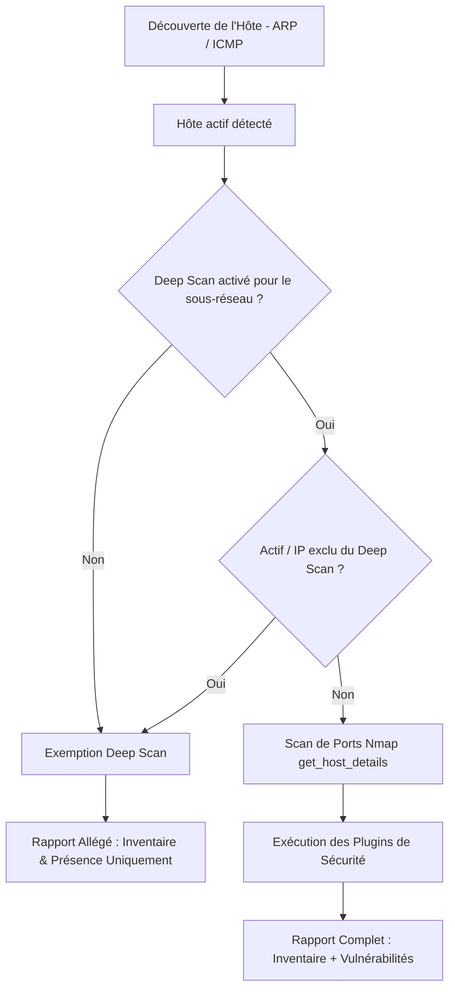

# Ciblage Granulaire du Deep Scan (Sous-réseaux & Exclusions d'Actifs)

La suite **RTMS** permet de moduler précisément la profondeur d'audit lors des scans approfondis (**Deep Scan** / `CMD_DISCOVER_SCAN`).

Cette granularité répond à deux exigences opérationnelles majeures :
1. **Protection des équipements sensibles (OT / IoT / Médical / Imprimantes)** : éviter d'exécuter des scans de ports TCP intrusifs ou des plugins de sécurité sur des automates programmables (PLC), du matériel SCADA ou des imprimantes tout en conservant leur visibilité et inventaire (ARP / ICMP / MAC).
2. **Optimisation des performances et priorisation réseau** : concentrer l'analyse en profondeur (ports, bannières, détection de vulnérabilités, audits SMTP/DNS) uniquement sur les sous-réseaux d'infrastructure et de serveurs critiques.

---

## 1. Principes de Fonctionnement

Lorsqu'un cycle de scan approfondi (**Deep Scan**) est déclenché par l'orchestrateur :



### Comportement d'un Actif Exempté
Lorsqu'un actif est exempté du Deep Scan (soit parce que son sous-réseau est configuré avec `deep_scan: false`, soit parce que l'actif lui-même est marqué avec `deep_scan_excluded: true`) :
* **Découverte et inventaire préservés** : l'adresse IP, l'adresse MAC, le fabricant (OUI vendor) et le nom d'hôte continuent d'être détectés et remontés au backend.
* **Aucun scan de ports intrusif** : l'appel Nmap `get_host_details()` est court-circuité (`ports: {}`).
* **Aucun plugin de sécurité exécuté** : `run_host_plugins_audit()` n'est pas appelé sur cet hôte.
* **Traçabilité** : un log d'information explicite est enregistré dans le journal du scanner :
  ```text
  [INFO] Asset 192.168.1.50 is excluded from Deep Scan (asset exclusion rule). Skipping port scan and security plugins.
  ```

---

## 2. Configuration au Niveau Sous-Réseau (Subnet Deep Scan)

Il est possible d'activer ou désactiver le Deep Scan pour chaque sous-réseau indépendamment.

### Règles d'Évaluation
* **Si une liste de sous-réseaux autorisés est définie (`scanner.deep_scan_subnets`)** : seuls les hôtes appartenant à ces sous-réseaux (ou à leurs sous-réseaux enfants CIDR) subissent un scan approfondi.
* **Si une liste d'exclusion est définie (`scanner.deep_scan_exclude_subnets`)** : tout sous-réseau listé est ignoré lors du Deep Scan.

### Clés de Configuration Scanner

| Clé | Type | Exemple | Description |
| :--- | :--- | :--- | :--- |
| `scanner.deep_scan_subnets` | Liste CSV | `192.168.10.0/24, 10.0.0.0/16` | Seuls ces sous-réseaux feront l'objet d'un scan approfondi. |
| `scanner.deep_scan_exclude_subnets` | Liste CSV | `192.168.99.0/24, 172.16.20.0/24` | Sous-réseaux explicitement exclus du scan approfondi. |

### Configuration via l'API & Base de Données (`rtms-web`)

Dans la base de données PostgreSQL, la table `admin.subnet_names` et `scanner.networks` disposent de la colonne :
* `deep_scan BOOLEAN DEFAULT TRUE`

Endpoint de mise à jour :
```http
POST /api/subnets/name
Content-Type: application/json
Authorization: Bearer <token>

{
  "subnet": "192.168.99.0/24",
  "name": "Réseau Automates PLC / SCADA",
  "deep_scan": false
}
```

---

## 3. Exclusion au Niveau Actif (Asset-Level Exclude)

Un actif individuel peut être exclu du Deep Scan même si son sous-réseau est configuré pour être scanné en profondeur.

### Clés de Configuration Scanner

| Clé | Type | Exemple | Description |
| :--- | :--- | :--- | :--- |
| `scanner.deep_scan_exclude_ips` | Liste CSV | `192.168.1.50, 192.168.1.100` | Adresses IP individuelles ou plages CIDR exclues du Deep Scan. |

### Configuration via l'API & Base de Données (`rtms-web`)

Les tables `admin.assets` et `admin.tenant_assets` disposent de la colonne :
* `deep_scan_excluded BOOLEAN NOT NULL DEFAULT FALSE`

Endpoint de mise à jour d'un actif :
```http
POST /api/assets/update
Content-Type: application/json
Authorization: Bearer <token>

{
  "ip": "192.168.1.50",
  "deep_scan_excluded": true
}
```

Lors de la récupération de la configuration par l'agent (`GET /api/scanner/config`), la liste des hôtes connus transmet la directive :
```json
{
  "deep_scan_subnets": ["192.168.1.0/24"],
  "deep_scan_exclude_subnets": ["192.168.99.0/24"],
  "deep_scan_exclude_ips": ["192.168.1.50"],
  "known_hosts": [
    {
      "ip": "192.168.1.50",
      "mac": "00:11:22:33:44:55",
      "hostname": "printer-label-01",
      "deep_scan_excluded": true
    }
  ]
}
```

---

## 4. Tests et Validation

Une suite de tests unitaires dédiée valide le comportement dans [`tests/test_deep_scan_targeting.py`](file:///Users/marctritschler/git_projects/rtms-scanner/tests/test_deep_scan_targeting.py) :
* Résolution CIDR et correspondance de sous-réseaux (`_subnet_matches`).
* Respect strict des listes d'inclusion et d'exclusion de sous-réseaux (`is_deep_scan_for_subnet`).
* Respect des exclusions par adresse IP d'actif (`is_asset_deep_scan_excluded`).
* Maintien des données d'inventaire de base et court-circuitage complet des scans de ports et des plugins pour les hôtes exemptés.
